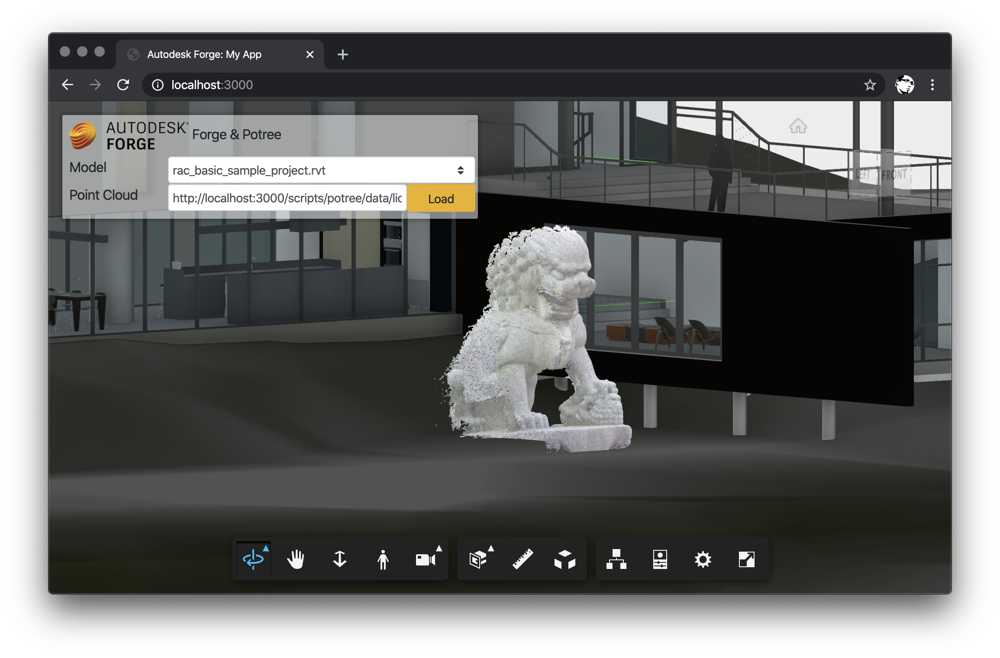

# Forge + Potree Point Cloud Integration

Integração de nuvens de pontos Potree com modelos BIM no Autodesk Forge/APS Viewer, incluindo pipeline completo de conversão LAS/LAZ para formato Potree.



## Arquitetura

```
┌─────────────────────────────────────────────────────────────────────────────┐
│                              FRONTEND                                        │
├─────────────────────────────────────────────────────────────────────────────┤
│                                                                              │
│  ┌─────────────────────────┐       ┌─────────────────────────────────────┐  │
│  │     index.html          │       │     forge-potree-native.html        │  │
│  │  ───────────────────    │       │  ─────────────────────────────────  │  │
│  │  📤 Upload LAS/LAZ      │       │  🎮 Forge Viewer + Point Clouds     │  │
│  │  📊 Progresso conversão │  ──►  │  🏗️ Modelos BIM                     │  │
│  │  📂 Lista de datasets   │       │  ☁️ Nuvens de pontos (Potree 1.x/2.0)│  │
│  │  🗑️ Gerenciar datasets  │       │  🎛️ Controles de visualização       │  │
│  └─────────────────────────┘       └─────────────────────────────────────┘  │
│                                                                              │
└─────────────────────────────────────────────────────────────────────────────┘
                                      │
                                      ▼
┌─────────────────────────────────────────────────────────────────────────────┐
│                              BACKEND (Node.js)                               │
├─────────────────────────────────────────────────────────────────────────────┤
│                                                                              │
│  /api/las/upload      POST   →  Upload e conversão de arquivos LAS/LAZ      │
│  /api/las/datasets    GET    →  Lista datasets convertidos                   │
│  /api/las/dataset/:id DELETE →  Remove dataset                               │
│  /api/las/health      GET    →  Status do sistema                            │
│                                                                              │
│  /api/auth/token      GET    →  Token de acesso Forge                        │
│  /api/data/models     GET    →  Lista modelos BIM                            │
│                                                                              │
└─────────────────────────────────────────────────────────────────────────────┘
                                      │
                                      ▼
┌─────────────────────────────────────────────────────────────────────────────┐
│                           POTREE CONVERTER                                   │
├─────────────────────────────────────────────────────────────────────────────┤
│                                                                              │
│  LAS/LAZ  →  PotreeConverter.exe  →  metadata.json + octree.bin + hierarchy │
│                                       (Potree 2.0 format)                    │
│                                                                              │
└─────────────────────────────────────────────────────────────────────────────┘
```

## Páginas

### 📤 Upload de Point Clouds (`index.html`)

Página dedicada ao upload e conversão de arquivos LAS/LAZ:

- **Drag & drop** de arquivos `.las` ou `.laz`
- **Barra de progresso** durante upload e conversão
- **Lista de datasets** convertidos com opções de copiar URL e excluir
- **Status do sistema** (PotreeConverter disponível)
- Suporte a arquivos de até **2 GB**

### 🎮 Visualizador Integrado (`forge-potree-native.html`)

Visualizador Forge com integração de nuvens de pontos:

- **Modelos BIM** carregados do Autodesk Forge/APS
- **Nuvens de pontos** Potree (formato 1.x e 2.0)
- **Controles de transformação** (posição, escala)
- **Point budget** e **point size** ajustáveis
- **Seleção de datasets** convertidos direto na interface
- **Estatísticas** em tempo real (pontos renderizados, nós visíveis)

## Instalação

### 1. Clonar repositório

```bash
git clone https://github.com/seu-usuario/forge-potree-demo.git
cd forge-potree-demo
```

### 2. Instalar dependências

```bash
npm install
```

### 3. Configurar variáveis de ambiente

Crie um arquivo `.env` na raiz do projeto:

```env
# Autodesk Forge/APS Credentials
APS_CLIENT_ID=seu_client_id
APS_CLIENT_SECRET=seu_client_secret

# Server
PORT=3000

# PotreeConverter (obrigatório para conversão)
POTREE_CONVERTER_PATH=C:\Tools\PotreeConverter\PotreeConverter.exe

# Storage (opcional)
STORAGE_TYPE=local
LOCAL_STORAGE_PATH=./public/datasets

# Limits (opcional)
MAX_LAS_FILE_SIZE=2147483648
```

### 4. Instalar PotreeConverter

O PotreeConverter é necessário para converter arquivos LAS/LAZ.

**Windows:**
1. Baixe de: https://github.com/potree/PotreeConverter/releases
2. Extraia em uma pasta (ex: `C:\Tools\PotreeConverter\`)
3. Configure `POTREE_CONVERTER_PATH` no `.env`

**Linux/Mac:**
```bash
git clone https://github.com/potree/PotreeConverter.git
cd PotreeConverter
mkdir build && cd build
cmake ..
make
sudo make install
```

### 5. Iniciar servidor

```bash
npm start
```

## Uso

### Fluxo de Trabalho

1. **Acesse** `http://localhost:3000/`
2. **Faça upload** de um arquivo `.las` ou `.laz`
3. **Aguarde** a conversão para formato Potree
4. **Copie** a URL do dataset ou acesse o visualizador
5. **Visualize** em `http://localhost:3000/forge-potree-native.html`
6. **Carregue** um modelo BIM
7. **Selecione** o dataset convertido e carregue a nuvem de pontos

### URLs

| URL | Descrição |
|-----|-----------|
| `http://localhost:3000/` | Upload de arquivos LAS/LAZ |
| `http://localhost:3000/forge-potree-native.html` | Visualizador Forge + Potree |
| `http://localhost:3000/api/las/health` | Status do sistema |
| `http://localhost:3000/api/las/datasets` | Lista de datasets (JSON) |

## Formatos Suportados

### Entrada
- `.las` - LAS Point Cloud
- `.laz` - LAZ Compressed Point Cloud

### Saída (Potree)

O sistema suporta ambos os formatos de saída do PotreeConverter:

| Formato | Arquivos | PotreeConverter |
|---------|----------|-----------------|
| **Potree 1.x** | `cloud.js` + `data/*.bin` + `*.hrc` | v1.x |
| **Potree 2.0** | `metadata.json` + `octree.bin` + `hierarchy.bin` | v2.x |

A detecção do formato é automática baseada no arquivo de metadados.

## API Reference

### POST /api/las/upload

Upload e conversão de arquivo LAS/LAZ.

**Request:** `multipart/form-data` com campo `file`

**Response:**
```json
{
  "success": true,
  "datasetId": "uuid",
  "cloudJsUrl": "/datasets/uuid/metadata.json",
  "potreeFormat": "2.0",
  "metadata": {
    "points": 37212593,
    "boundingBox": { "min": [...], "max": [...] }
  },
  "duration": 34736
}
```

### GET /api/las/datasets

Lista todos os datasets convertidos.

**Response:**
```json
[
  {
    "datasetId": "uuid",
    "cloudJsUrl": "/datasets/uuid/metadata.json",
    "potreeFormat": "2.0",
    "type": "local"
  }
]
```

### GET /api/las/health

Status do sistema.

**Response:**
```json
{
  "converterAvailable": true,
  "storageType": "local",
  "pendingUploads": 0,
  "activeConversions": 0
}
```

## Estrutura do Projeto

```
forge-potree-demo/
├── server.js                    # Servidor Express
├── config.js                    # Configurações
├── package.json                 # Dependências
├── .env                         # Variáveis de ambiente
│
├── routes/
│   └── api/
│       ├── auth.js              # Autenticação Forge
│       ├── data.js              # Modelos BIM
│       └── las.js               # Upload LAS/LAZ
│
├── services/
│   ├── lasUploadController.js   # Orquestração de upload
│   ├── potreeConversionService.js # Execução PotreeConverter
│   ├── datasetStorageService.js # Gerenciamento de storage
│   └── validationUtils.js       # Validação de output
│
├── public/
│   ├── index.html               # 📤 Página de upload
│   ├── forge-potree-native.html # 🎮 Visualizador
│   ├── datasets/                # Datasets convertidos
│   └── scripts/
│       └── potree/
│           ├── Potree2Loader.js # Loader Potree 2.0
│           ├── ForgePotreePointCloudExtension.js # Extension Forge
│           └── PotreeExtension.js
│
└── temp/                        # Arquivos temporários
    └── uploads/
```

## Extensões Forge

### ForgePotreePointCloudExtension

Extension principal para renderização de nuvens de pontos no Forge Viewer:

- Suporta **Potree 1.x** e **Potree 2.0**
- Streaming/LOD automático
- Renderização via `THREE.Points` em overlay scene
- Point budget configurável
- Detecção automática de formato

**Uso:**
```javascript
const ext = viewer.getExtension('ForgePotreePointCloudExtension');

// Carregar nuvem de pontos (detecta formato automaticamente)
await ext.loadPointCloud('myCloud', '/datasets/uuid/metadata.json', {
    position: new THREE.Vector3(0, 0, 0),
    scale: 1.0
});

// Controles
ext.setPointSize('myCloud', 3);
ext.togglePointCloud('myCloud');
ext.setPointBudget(5000000);

// Stats
console.log(ext.getStats());
```

## Troubleshooting

| Problema | Solução |
|----------|---------|
| "PotreeConverter não encontrado" | Configure `POTREE_CONVERTER_PATH` no `.env` |
| "File too large" | Aumente `MAX_LAS_FILE_SIZE` no `.env` |
| "Conversion failed" | Verifique se o arquivo LAS/LAZ é válido |
| Pontos não aparecem | Verifique a escala e posição da nuvem |
| Performance ruim | Reduza o Point Budget |

## Limitações

- Tamanho máximo de arquivo: 2 GB (configurável)
- Conversão síncrona (uma por vez)
- Storage local apenas (S3 preparado mas não testado)

## Roadmap

- [ ] Fila de processamento para múltiplos uploads
- [ ] Upload direto para S3
- [ ] WebSocket para progresso em tempo real
- [ ] Suporte a arquivos > 2GB via chunked upload
- [ ] Colorização por intensidade/classificação

## Licença

MIT

## Créditos

- [Potree](https://github.com/potree/potree) - Point cloud rendering
- [PotreeConverter](https://github.com/potree/PotreeConverter) - LAS/LAZ conversion
- [Autodesk Forge](https://forge.autodesk.com/) - BIM viewer platform
